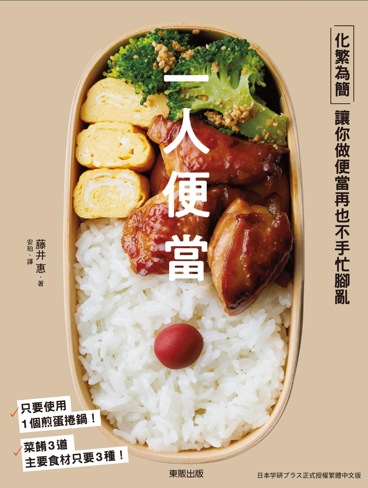
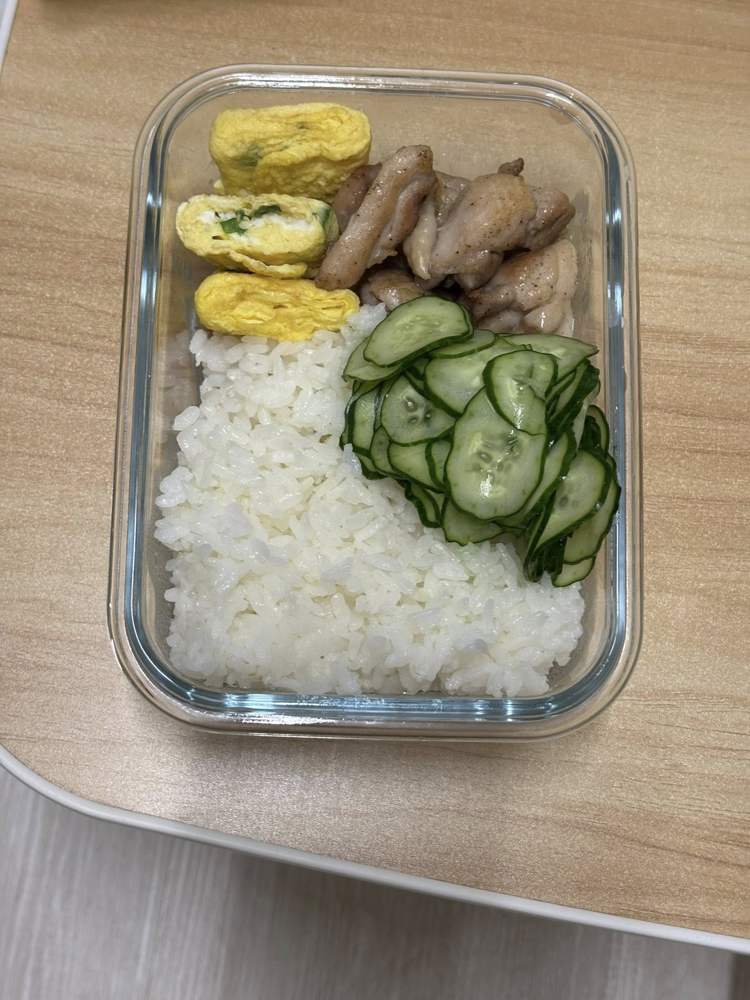
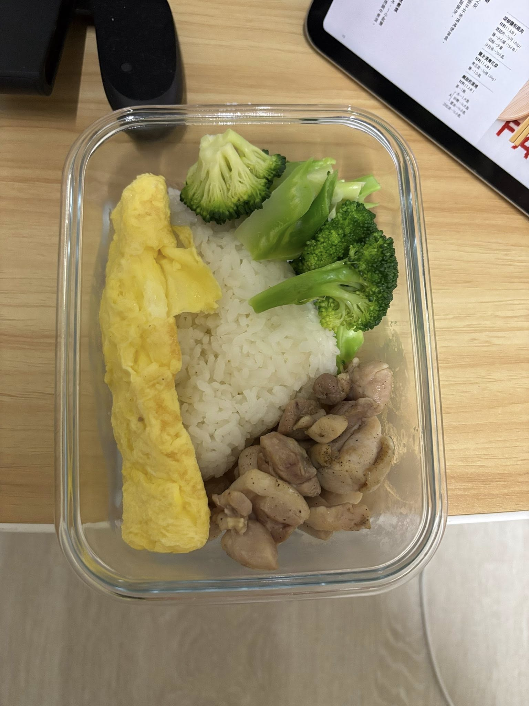
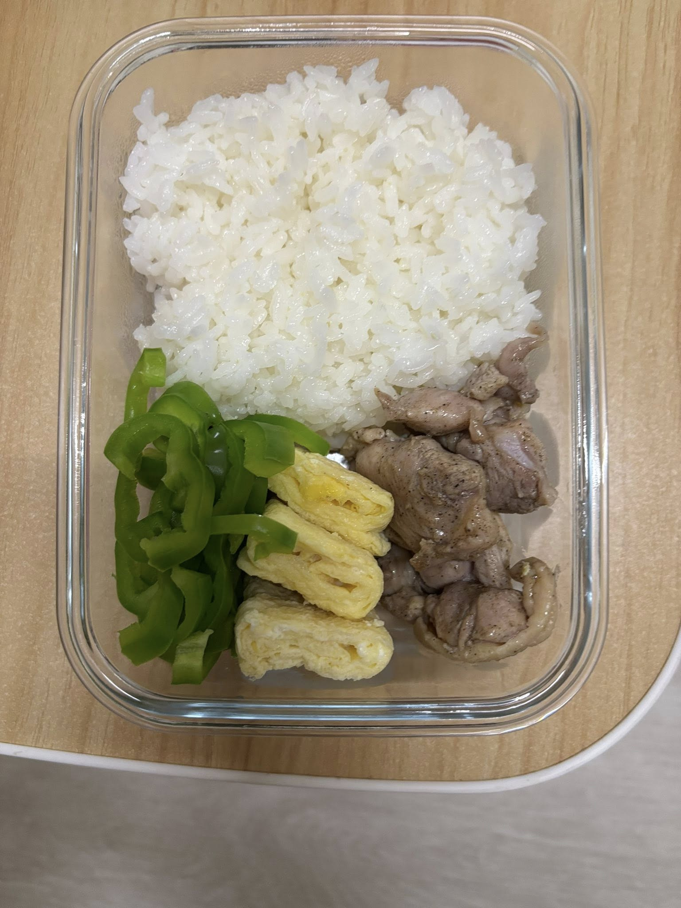
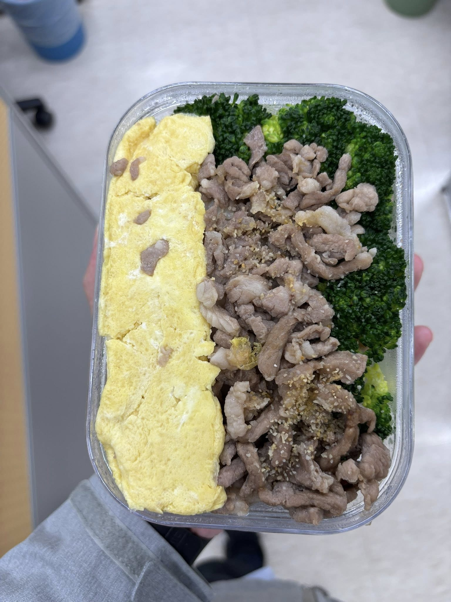

# 再次挑戰自煮

三週前再次嘗試自己做便當。並總結五年前失敗且堅持不久的原因有：
1. 難吃 
2. 費時費力

所以這一次我試閱了十幾本食譜，買了兩本，最後選出一本介紹如何每天製造便當的食譜。一次解決了我的兩個問題。我發現五年前菜做得不好吃的最大原因是缺乏標準化，這次我買了食譜、標準湯匙、量杯，菜的味道就穩定下來了。費時費力的部分我透過一次製造多餐解決。在保證比7-11微波便當新鮮的前提下，我最多可以一次煮四餐。結果上煮菜洗碗的時間和出門外食的時間成本幾乎相同，都是30分鐘。
<figure>
    
    <figcaption>圖一：食譜《一人便當》封面。</figcaption>
</figure>

<figure>
    
    <figcaption>圖二：便當一</figcaption>
</figure>

<figure>
    
    <figcaption>圖三：便當二</figcaption>
</figure>

<figure>
    
    <figcaption>圖四：便當三</figcaption>
</figure>

<figure>
    
    <figcaption>圖五：便當四</figcaption>
</figure>

## 小結
我很喜歡《一人便當》把簡單的東西做到極致的感覺。減法美學特別吸引我。