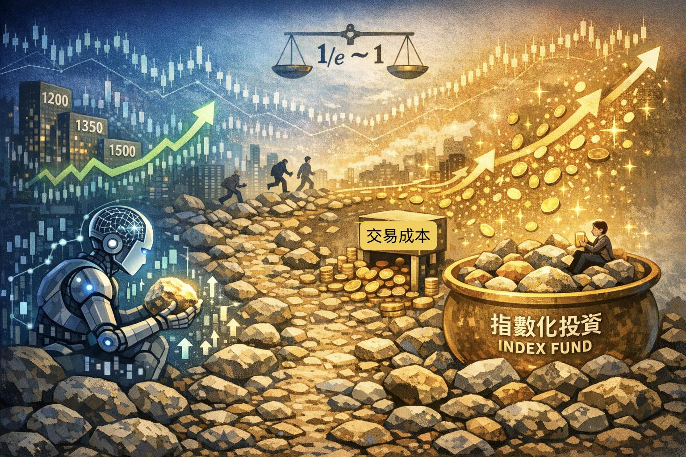

# 可以利用深度學習模型預測股票嗎？
<figure>
    
    <figcaption>圖一：AI投資與指數投資的示意圖。</figcaption>
</figure>
是這樣沒錯，但不是這樣。我覺得這一切要從撿石頭理論開始說起。

你走在一條充滿石頭的路上，只能往前不能回頭，且同時只能撿一顆石頭，如何最大化撿到最大顆石頭的機率呢？ 最佳解法是觀察前1/e 部分的石頭，並記錄最大的石頭的尺寸。在剩下的路途中一旦看到比紀錄更大的石頭就毫不猶豫的撿起來，這樣有1/e的機率撿到最大的石頭。
我注意到即便拿出了最佳策略，仍然不能保證100%撿到最大顆的石頭。

如果今天走在路上的不是人，而是錢。撿的也不是石頭，而是投資標的，那麼是不是也說明最佳投資策略也不能100%撿到最大顆的石頭呢？
我們可以試著推廣撿石頭理論，令我們的主角是市場中的一枚最小單位且不可分割的錢，每一個單位時間都可以投資在市場上的某一個標的。假設交易是自由的，錢必然能夠在看到好資產的時候立刻轉移過去。但是由於手續費的存在，交易並不真的自由。由此我們相信其結果應介於完全自由交易與棋手無悔之間，也就是說，仍無法100%保證買到最讚的投資標的。

假設今天存在一個神模型，能夠瞬間判斷當下的投資標的未來的報酬率，並且使用了我們的廣義撿石頭理論進行投資，會發生什麼事呢？這樣的模型會令市場上所有的投資標的的報酬率都趨於一致，因為一旦出現報酬率較高的資產，則神模型就會立刻買入，令資產價格上升，報酬率下降。
神模型雖然能瞬間看清每個資產的真實報酬率，但無論買哪一個資產，獲得最大報酬率的機率仍介於1/e到1之間。而且隨著越多人解鎖神模型，各資產的報酬率會逐漸收斂到同一個數。最後市場上只剩下價格噪音。因此必然存在一個損益平衡點，使得神模型的成本等於能獲得的收益，超過就開始賠錢。

## 小結
1. 即使神模型存在，但是能夠帶來的優勢很有限，還要消耗一大筆手續費。相當於自費替指數投資人維持市場效率。
2. 當神模型的市佔率到達一定的程度後，即時是指數投資人也能獲得跟神模型一樣的報酬率。
3. 獲得最大報酬率的機率跟投資眼光無關，只跟交易成本有關，成本越低、成交越快，則最大報酬率的機率越接近1。