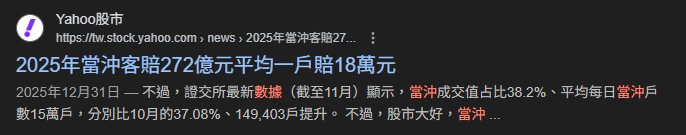
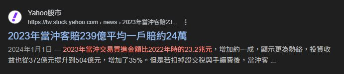

# 當沖能賺錢嗎？
過去近三個月台股指數增加了20%，指數投資人賺了，那麽當沖戶賺到錢了嗎?可惜並沒有，還賠錢。

我從台灣證券交易所下載了2025年12月1日到2026年2月9日的每月當日沖銷交易標的及統計，當沖客的總買進金額是11.888兆，總賣出金額是11.920兆，毛利潤率是0.268%，扣除手續費(0.07125% x2)與證券交易稅(0.15%)後的淨利潤率是負的0.025%。

當沖在股市低迷的2023年賠錢，大漲的2024、2025年間也賠錢。在三個月內大漲20%的股票現貨市場中也賠錢。更別說期貨和做空了，那些方法的費用更高更不可能賺錢。當沖戶實際上就是自費為台股創造流動性的。

<figure>
    
    <figcaption>圖一：當沖戶在2025年的淨利潤。</figcaption>
</figure>

<figure>
    
    <figcaption>圖二：當沖戶在2024年的淨利潤。</figcaption>
</figure>

<figure>
    
    <figcaption>圖三：當沖戶在2023年的淨利潤。</figcaption>
</figure>