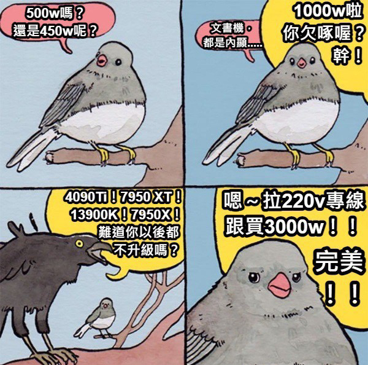

# 測試 Copilot 的文章轉網頁能力
我正在執行網站搬移，從Bluehost 轉移到Github Pages。
目前已經將所有的舊內容轉移到Github Pages，但是我還不確定能不能在新內容上套用舊的模板，所以寫一篇文章試試看。
我需要測試
1. 烏鴉與斑鳩 
<figure>
    
    <figcaption>圖一：一張烏鴉與斑鳩爭論的照片。</figcaption>
</figure>

2. 惠美姐的夯吉寶 
<figure>
    
    <figcaption>圖二：夯吉寶示意圖</figcaption>
</figure>

3. 冰淇淋銷量與溺水人數表格

|月份	|冰淇淋銷售額 (單位：億美元)	|溺水事故人數 (全球估計值)
|---|---|---|
|2025/04	|78.5	|18,200
|2025/05	|92.3	|21,500
|2025/06	|125.8	|29,800
|2025/07	|154.2	|38,600
|2025/08	|148.9	|35,200
|2025/09	|102.4	|24,100
|2025/10	|81.2	|19,400
|2025/11	|65.7	|15,300
|2025/12	|72.1 (節慶回升)	|13,800
|2026/01	|58.4	|12,500
|2026/02	|62.9	|13,100
|2026/03	|74.6	|16,400