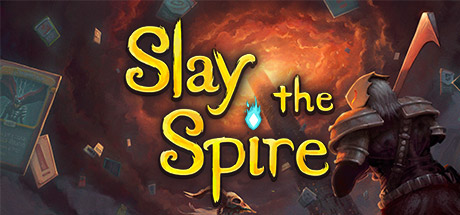

# 解構 Slay the Spire

## 基本資料
+ 遊戲類型：Rouge-like 卡牌戰鬥遊戲
+ 創作方式：原創遊戲
+ 發售日期：
+ 破局遊戲時間：約20小時(首次通關最終Boss)
+ 遊戲流程：Rouge-like 戰鬥

## 核心玩法
回合制卡牌戰鬥遊戲。玩家在有限隨機的地圖上，與有限隨機的敵人對戰。戰鬥勝利能獲得遺物或是卡牌。遺物與卡牌可以提升玩家的戰鬥能力。目標是戰勝最終Boss。

### 回合制戰鬥
有限能量、非對稱的卡牌回合制戰鬥。回合開始時，玩家抽5張牌。每張牌有各自的效果，也有消耗的能量。如果能量不足，則無法使用卡牌。己方回合與敵方回合交錯執行。敵方使用固定行為模板，並且可以在前一個回合（己方回合）知道每一個敵方將會做什麼。

## 多巴胺機制
透過頻繁的小戰鬥讓玩家每數十秒鐘就能夠提升牌組、提升角色素質、獲得遺物，隨機獲得高級遺物或高級卡牌也放大了隨機性帶來的多巴胺。

戰鬥的隨機性來自
1. 隨機抽牌
2. 隨機的三選一卡牌獎勵
3. 隨機的敵人
4. 隨機的敵人行為模板
5. 隨機的攻擊傷害值

大量且來源廣泛的隨機性可以帶來和賭博類似的快感。

### 遊戲動力學(Game Dynamic)
|輸入|➡️|輸出|
|---|---|---|
|卡牌|➡️|戰鬥力|
|卡牌搭配|➡️|戰鬥力|
|戰鬥力|➡️|卡牌、遺物、buff、金錢、地圖|
|遺物|➡️|戰鬥力、卡牌、地圖、金錢|
|金錢|➡️|卡牌、遺物|
|地圖|➡️|卡牌、金錢、隨機事件|
|隨機事件|➡️|卡牌、遺物、金錢、buff|

### 戰鬥力動力學(Tactic Dynamic)
數值列表
+ 生命值
+ 能量
+ 卡牌
+ 抽牌堆
+ 棄牌堆
+ 燒牌堆
+ 濾牌速度
+ 遺物
+ 力量修正
+ 敏捷修正

輸出手段：能量 x (力量修正 + 卡牌) x 濾牌速度 x 遺物 
威脅：被污染的牌堆, 已消耗生命值, 已消耗卡牌(燒牌堆), 負面的敏捷修正 
中性數值：卡牌 

## 套路
+ 玩多了還是會覺得重新開始很打擊玩家的信心。
+ 過多的彩蛋與寡淡的劇情，藉此以最低成本提高遊戲的深度。

## 反套路
+ 作為卡牌Rogue like 遊戲的鼻祖，所有機制都是主流。

## 小結
遊戲設計者在恰當的時機給予玩家獎勵，令《Slay the Spire》成為令人沈迷的遊戲。